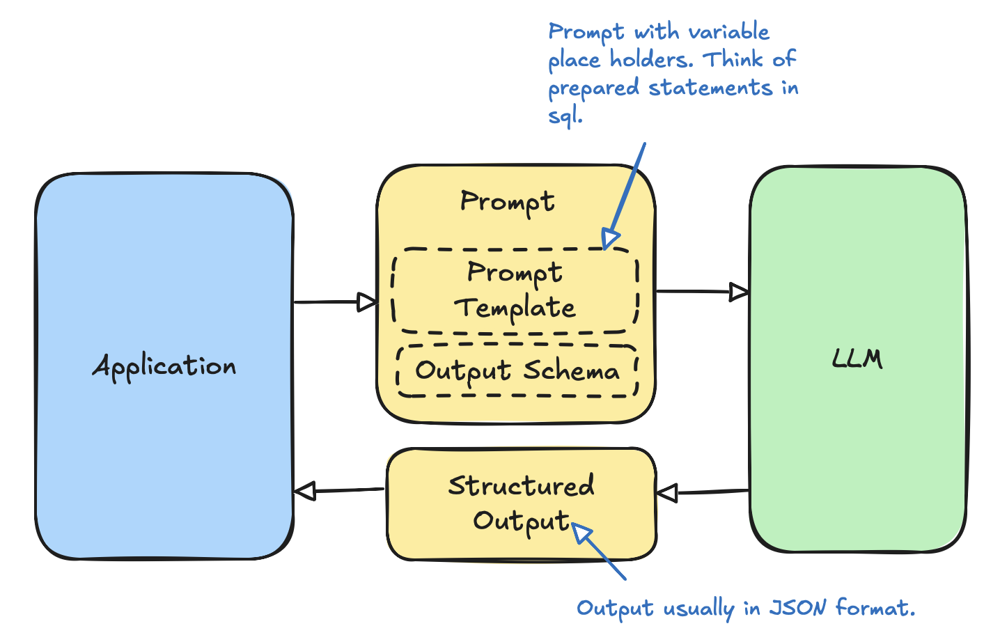

# AI Design Patterns

LLM powered applications are gaining traction at the moment. There are many useful architectural patterns that you can use to achieve the objectives. However, there aren't any comprehensive guide on which architecture(s) to choose, what their tradeoffs and suitable use cases. Further, existing referneces are unnecesrily complex at times. I believe a good architecture is simple and satisifies the functional specification. I focus on the most common patterns used in practical systems. This serves as a one-stop guide to select the right AI design pattern for your next LLM powered application.

## Prompting Pattern
This is by far the most common pattern of using LLMs in applications. With LLMs becoming increasingly capable (e.g. GPT 4o or Gemini Flash 2) and supporting very large context windows (over a million tokens), prompting is the first strategy one would implement and evaluate.

Prompting strategies could be zero to a few shot (i.e. providing a few example prompt-output pairs) or CoT (Chain of Thought). LLM could be running locally (e.g. on Ollama) or accessed via a direct API (e.g. OpenAI or Gemini)/indirect API (e.g. LangGraph API).

<b> Pros </b>
* Low complexity (less things to go wrong and easier deployment and maintenance)
* Rapid iteration (iterating over differen prompting strategies is fast)
* Works many use cases where the task does not require external tools or input on some domain specific knowledge

<b> Cons </b>
* No memory (need to update the prompt with prior conversations everytime)
* Hallucination risk (no grounding available; also thinking is limited)
* Do not have access to tools to perform specialized operations (e.g. fetching the content of a web page to analyze)
* Knowledge cut-off (LLMs are trained data present before certain date in the past, so they don't have a clue on data after that date)

<b> Example Use Cases </b>
* Applications improving productivity (e.g. summerizing meeting notes, drafting an email)
* Language translation applications

## Tool Calling Pattern
This is also a very common design pattern where LLMs are augments with tool calling. For example, a tool could doing dynamic analysis on a piece of code in a sandbox environment and returning the behavior traces back to the LLM.

<b> Pros </b>

<b> Cons </b>

<b> Example Use Cases </b>

## Grounding Pattern
Grounding refers to providing LLMs with relevant information at inference time so that the answers produced are less likely to factually incorrect.

## RAG Pattern

## Memory Pattern

## Guardrails Pattern

## Filtering Pattern

## LLM-as-a-Judge Pattern

## Integrated Pattern
This pattern integrates all the patterns mentioned above. Think of an LLM as the CPU of an operating system and it would make sense to have an integrated pattern to tie all together and also have additional components to work with the stochastic nature of LLMs and natural language input/output interface. 

## Agent Pattern

## ReAct Agent Pattern

## Reflection Agent Pattern

