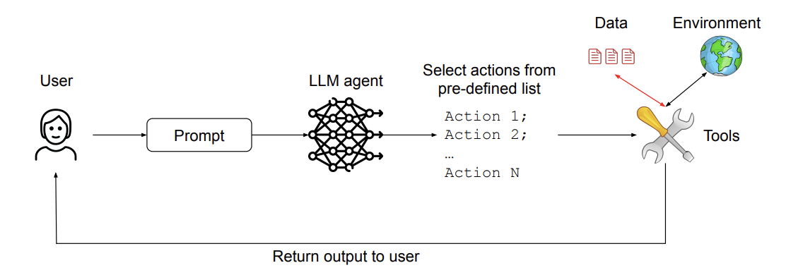
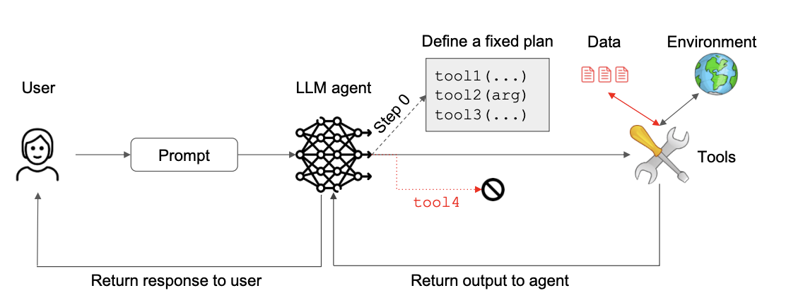
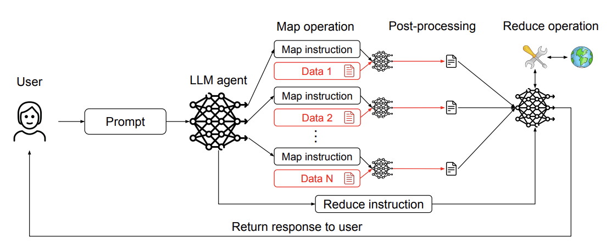
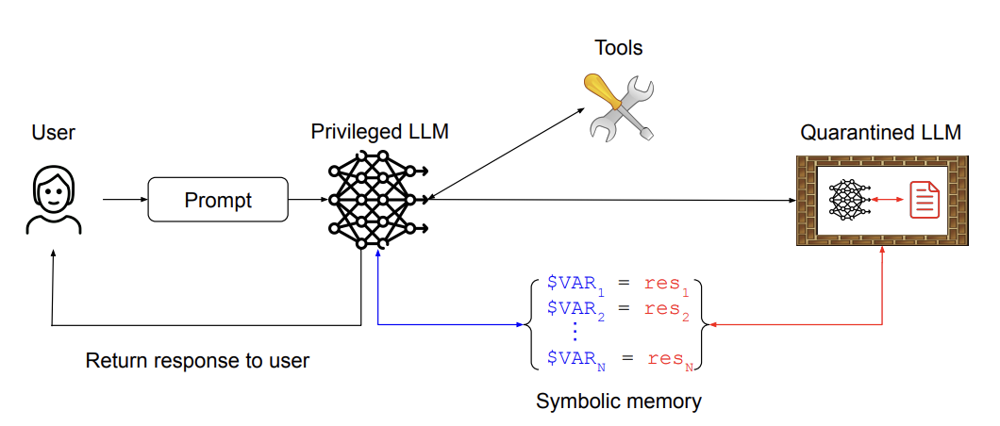
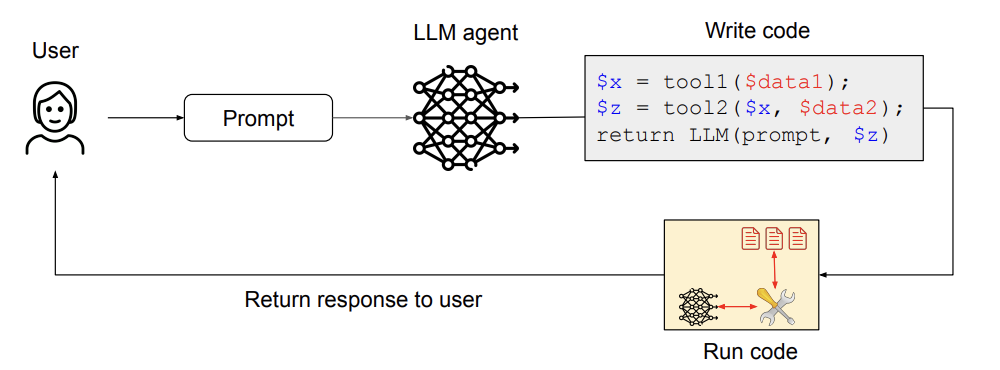
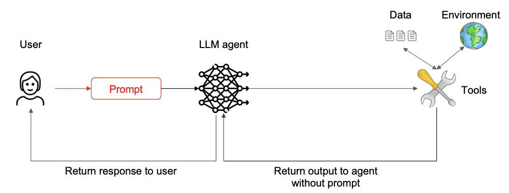

# Design Patterns for Securing LLM Agents

The recent [paper](https://arxiv.org/pdf/2506.08837) by authors from various organizations including IBM, Invariant Labs, ETH Zurich, Google and Microsoft proposes 6 design patterns to guard against prompt injection. This I believe a great extension to [the prior work](https://arxiv.org/pdf/2503.18813) by Google researchers. 

## The Action-Selector Pattern

The red color represents untrusted data. The LLM acts as a translator between a natural language prompt and a series of predefined actions to be executed over untrusted data.

## The Plan-Then-Execute Pattern

Before processing any untrusted data, the LLM defines a plan consisting of a series of allowed tool calls. A prompt injection cannot force the LLM into executing a tool that is not part of the defined plan.

## The LLM Map-Reduce Pattern

Untrusted documents are processed independently to ensure that a malicious document cannot impact the processing of another document.

## The Dual LLM Pattern

A privileged LLM has access to tools but never processes untrusted data. This LLM  can call a quarantined LLM to process untrusted data but without any tool access. Results from processing  untrusted data are stored in memory that the privileged LLM can manipulated by reference only.

## The Code-Then-Execute Pattern

The LLM writes a piece of code that can call tools and make calls to other LLMs. The code is then run on untrusted data.

## The Context-Minimization pattern

The user's prompt informs the actions of the LLM agent (e.g. a call to a specific tool), but is removed from the LLM's context thereafter to prevent it from modifying the LLM's response.
