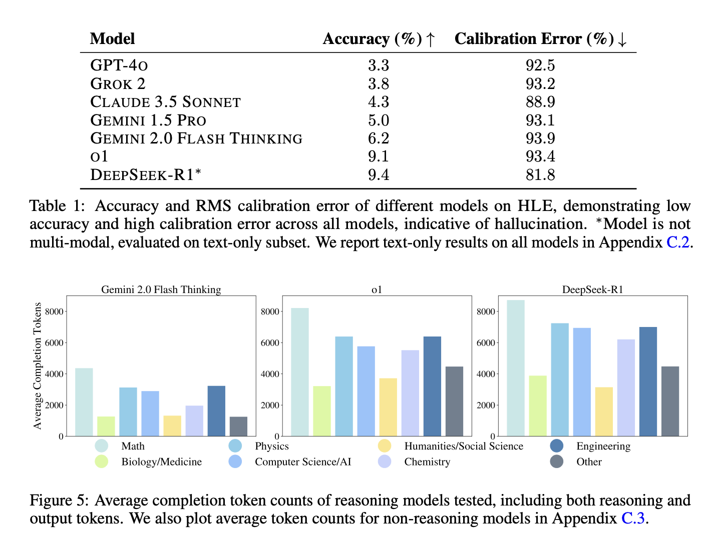

# Humanity's Last Exam

## What is this paper about?
Researcher from Scale AI, and Center for AI Safety came up with a benchmark consistings of 3000 question across dozens of subjects, including mathematics, humanities, and the natural science. DeepSeek-R1 is outperforming other state of the art models like O1 and Gemini 2 Flash Thinking. SoTA models achieves less than 10% of accuracy on this benchmark.

## What problem does it solve?
* HLE addresses the problem of saturated benchmarks for evaluating the capabilities of LLMs. Many benchmarks including MMLU is quite easy of the state of the art LLMs surpass over 90% accuracy. This benchmark introduces a 3000 extremely challenging questions across a several academic subjects.
* It supports multi-modal evaluation.
* The questions includes MCQs as well as exact anwers.
* SoTA LLMs demonstrates poor results on this benchmark, highlighting the need for improved capabilities.

## What are some limitations?
* It does not assess open-ended research or creative problem-solving abilities (only close-ended tasks).
* No public review of the benchmark as of yet.
* The benchmark expects graduate level expertise and this could in turn limit the broader applicability in other contexts.
* While DeepSeek-R1 leads in this benchmark, it is not clear how signficant it is given all models scored less than 10% accuracy on the tasks - a coin tossing would have a done better.

## What are some take aways for furture LLMs?
* Training LLMs to improve on this benchmark
* Improving model performance especially of those thinking models as they use way more tokens compared to the other models
