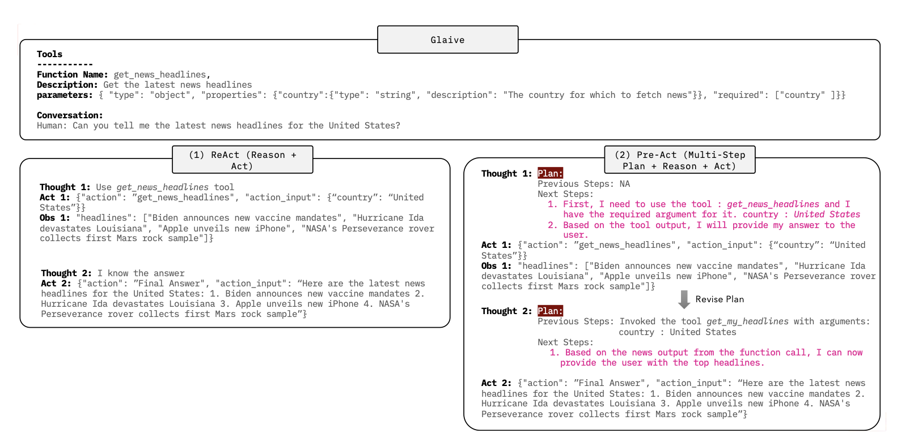

# Pre-Act: Multi-Step Planning and Reasoning Improves Acting in LLM Agents

## What is the problem addressed?
* ReAct focues on single-step reasoning and generating actions for immediate execution. Because of this, advanced prompting techniques like Chain-of-Thought, Self-Consistency, Three-of-Thought and Graph-of-Thought often struggle to work across multiple steps.
* We still dependent on large proprietary LLMs for complex reasoning and function calling abilities. Smaller models like Llama 8B or 70B still struggles in this front.
* Exising frameworks evalues either turn-level (i.e. individual task level) or end-to-end (i.e. overall) but not both.

## How is the problem resolved?
* PreAct addresses this probem by generating multi-step reasoning plan. Think of planning out future chess moves ahead of time.
* PreAct proposes a fine-tuning strategy leveraging datesets to make smaller models reason and call functions better.
* PreAct creates a two-level evaluation framework covering both turn-level and end-to-end.

## How does it compare to existing methods?
