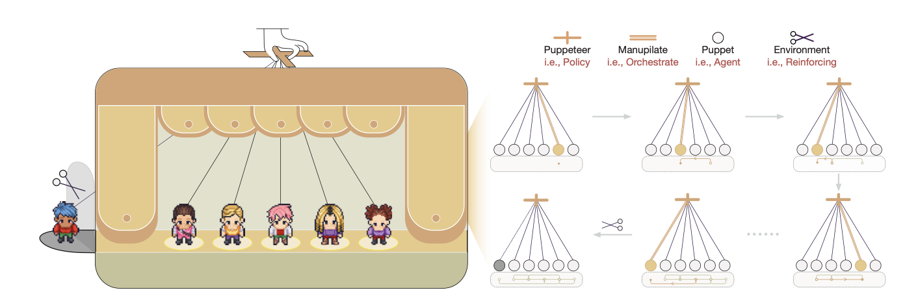

# Multi-Agent Collaboration via Evolving Orchestration

## What is the problem addressed?
* Existing multi-agent systems rely on static organizational structures or predefined agent topologies. Hence, they struggle to adapt to complex tasks and increased number of agents.

## What is the key idea?

